<p align="center">
  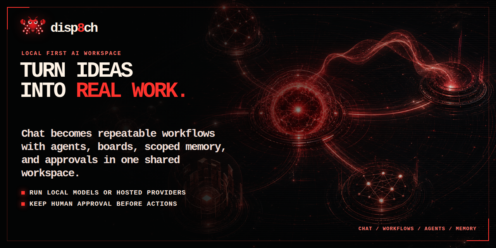
</p>

<p align="center">
  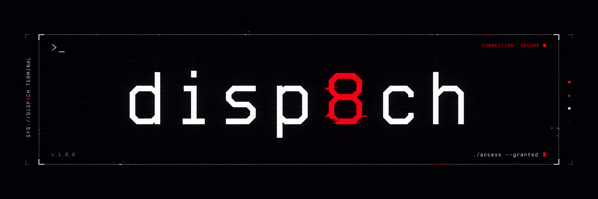
</p>

<p align="center">
  <a href="LICENSE"></a>
  <a href="https://nodejs.org/"></a>
</p>

<p align="center">
  <b><span style="color:#f4f4f5;">One local command center where chat turns into workflows, agents, memory, decisions, boards, and shipped work.</span></b>
</p>

<p align="center">
  <span style="color:#f4f4f5;">Build automations, run multi-agent organizations, remember what matters, and steer the whole workspace from plain-English WebChat.</span>
</p>

<p align="center">
  <a href="#quick-start">Quick Start</a> ·
  <a href="#run-fully-local-no-api-key">Local Model</a> ·
  <a href="#screenshots">Screenshots</a> ·
  <a href="#how-the-tabs-work-together">Tabs</a> ·
  <a href="#what-you-can-use-it-for">Use Cases</a> ·
  <a href="#migration-and-imports">Migration</a> ·
  <a href="CHANGELOG.md">Release Notes</a> ·
  <a href="#security-and-control">Security</a>
</p>

---

## What Is disp8ch?

disp8ch is a self-hosted AI workspace for people who want one local app to do the work of a chat assistant, automation builder, personal memory system, multi-agent dashboard, and autonomous company control plane.

Use it as:

- a normal assistant chat that can use tools and inspect app state;
- a visual workflow builder for cron jobs, webhooks, channel messages, agents, documents, HTTP, logic, and files;
- a local memory and skill system that can improve over time without hiding the data from you;
- a multi-agent operating dashboard with boards, goals, budgets, approvals, hierarchy, heartbeats, and audit trails;
- a research and design workspace that can gather evidence, create artifacts, and turn ideas into workflows.

The core idea is simple: install one app, connect one model, and start running personal or team workflows from a browser UI and plain-English chat. You do not have to choose between a chat agent, workflow builder, notebook, design tool, and agent-company dashboard. The primary navigation keeps daily work and Help visible; lower-frequency diagnostics and power tools are available under **More tools** and the command palette instead of competing with first-use tasks.

## What disp8ch Gives You

You can use disp8ch alongside the tools you already like. Its role is to give you one local workspace where chat, memory, workflows, documents, agents, decisions, boards, and generated artifacts can work together.

> **Already using another local assistant, notebook, automation builder, design workspace, or agent dashboard?** Keep using what works. When you want a shared local command center, disp8ch can import compatible skill libraries, workflow JSON, and company/org templates — skills, agents, roles, goals, budgets, and workflow structure move over when the source format is supported. Secrets are never copied silently. Jump to [Migration and Imports](#migration-and-imports).

| You want | disp8ch gives you |
|---|---|
| A fast local assistant | WebChat with model routing, tools, memory, files, sessions, and app-control prompts. |
| An agent that learns | Reviewable memory, learning candidates, reusable skills, session recall, and workspace startup files on disk. |
| Automations without hidden prompt chains | A visual workflow canvas with triggers, node contracts, replay, imports, exports, templates, queues, and testable runs. |
| Long-running autonomous work | Dynamic Runs with `/loop`, phase/worker ledgers, pause/resume/cancel, saved run commands, and Project Manager harness templates. |
| Scheduled and event-driven work | Cron schedules, signed webhooks, direct webhook responses, RSS reads, run-now actions, HMAC examples, and WebChat access to live automation state. |
| Messaging where you already work | WebChat plus Telegram, Discord, WhatsApp, Slack, Google Chat, Microsoft Teams, BlueBubbles/iMessage-style paths, and gateway status screens. |
| Many agents without chaos | Agent roles, tools, skills, budgets, models, channels, wakeups, approvals, and execution history. |
| Parallel work, not 20 lost terminals | Spawn background subagents with the active model by default, or explicitly choose an installed coding CLI; results return to the same session and appear in Activity. |
| A company-style command center | Boards, hierarchy, multiple organizations, goals with full goal ancestry, reporting lines, heartbeats, cost attribution, governance, and portable company packs. |
| Better decisions | Council sessions where multiple agents debate options, vote, and produce a recorded verdict. |
| Research notebooks without another isolated app | Data Sources manages uploads, crawls, notebooks, notes, generated outputs, and citations. Each notebook has an in-place assistant for source-specific follow-ups, while WebChat remains the global surface for broader actions. |
| Generated artifacts without leaving the workspace | Design Studio creates persistent UI concepts, dashboards, diagrams, landing pages, decks, and app screens from the same agent runtime. |
| Tools beyond the built-ins | Connect any MCP server, install extension packs, and expose custom tools — extend the agent without forking the app. |
| Research with current sources | Multi-provider web search (Tavily, Brave, DuckDuckGo), browser automation, source-cited briefs, and a repeatable experiment loop. |
| Voice in and out | Text-to-speech and speech-to-text nodes (ElevenLabs, Whisper, and provider-configurable) wired into workflows and channels. |
| Local model freedom | Direct API providers, OpenRouter, and OpenAI-compatible local servers such as Ollama, llama.cpp, LM Studio, vLLM, and SGLang — or run core features fully offline with no API key. |
| A smoother path in | Import compatible skills, workflow JSON, and company templates from local agent ecosystems when you want them in the same workspace. See [Migration](#migration-and-imports). |
| A public repo without private state | Clean release expectations: no database, API keys, memories, documents, auth state, or chat history committed. |

## Screenshots

<p align="center">
  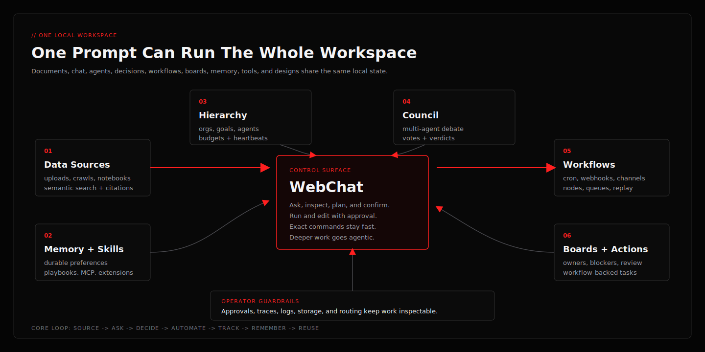
</p>

**One operating loop** — Data Sources, WebChat, Council, Hierarchy, Workflows, Boards, Memory, Skills, Design Studio, Usage, and local model routing share the same workspace instead of acting like separate apps.

<p align="center">
  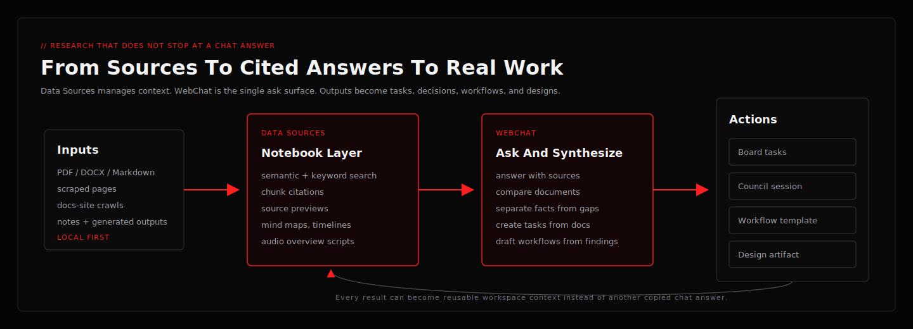
  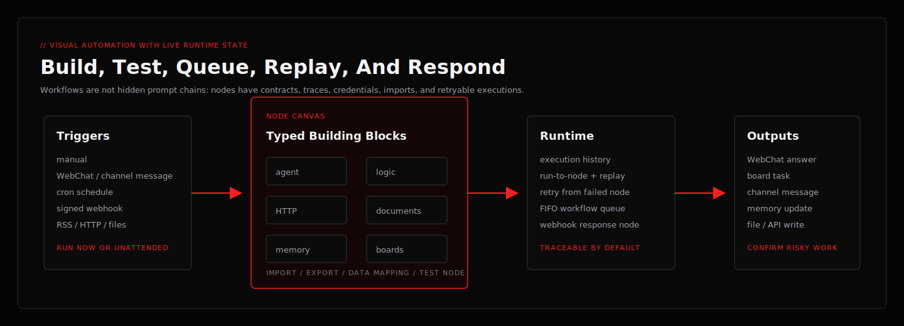
</p>

**Research becomes work** — source material can become cited answers, tasks, council sessions, workflows, and design artifacts. **Automation stays visible** — triggers, typed nodes, queues, traces, replay, and webhook responses are first-class runtime pieces.

<p align="center">
  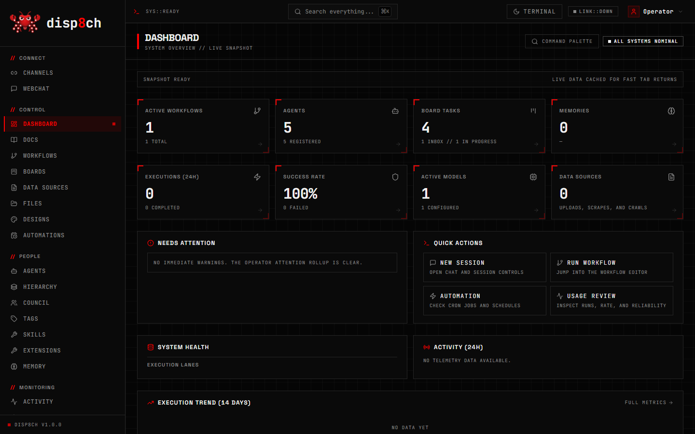
</p>

**Dashboard** — live system health, active workflows, agents, board tasks, execution lanes, and quick actions in one operator view.

<p align="center">
  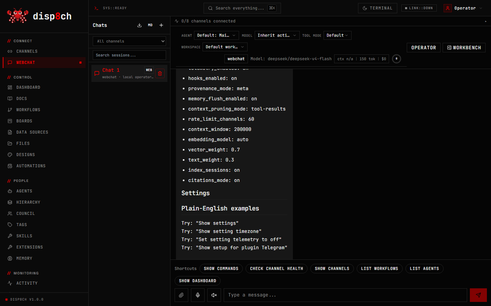
  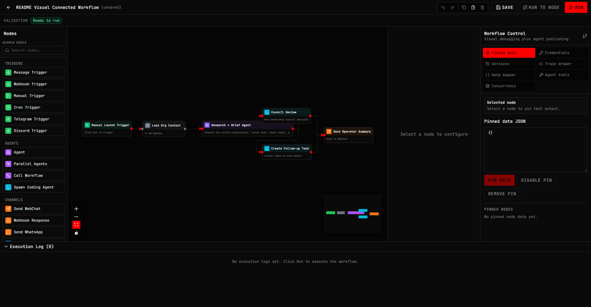
</p>

**WebChat** is the plain-English control surface for asking questions, inspecting app state, creating tasks, and running agentic tool work. **Workflows** is the visual automation canvas shown with real connected nodes: trigger → org context → agent brief → council/board follow-up → WebChat output.

<p align="center">
  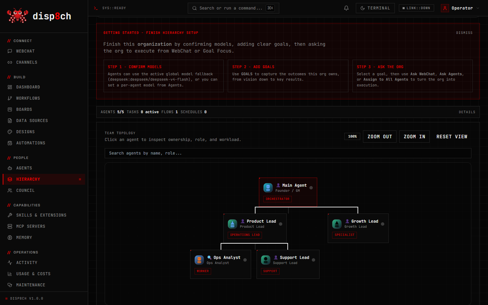
</p>

**Hierarchy** shows the whole agent organization together: roles, goals, reporting lines, heartbeats, governance context, budget status, workload, and agent ownership. Other major surfaces include **Boards** for task flow, **Council** for structured debate, **Data Sources** for searchable context, **Skills/Extensions/MCP** for tool growth, **Automations** for cron and webhooks, and **Design Studio** for generated artifacts.

<p align="center">
  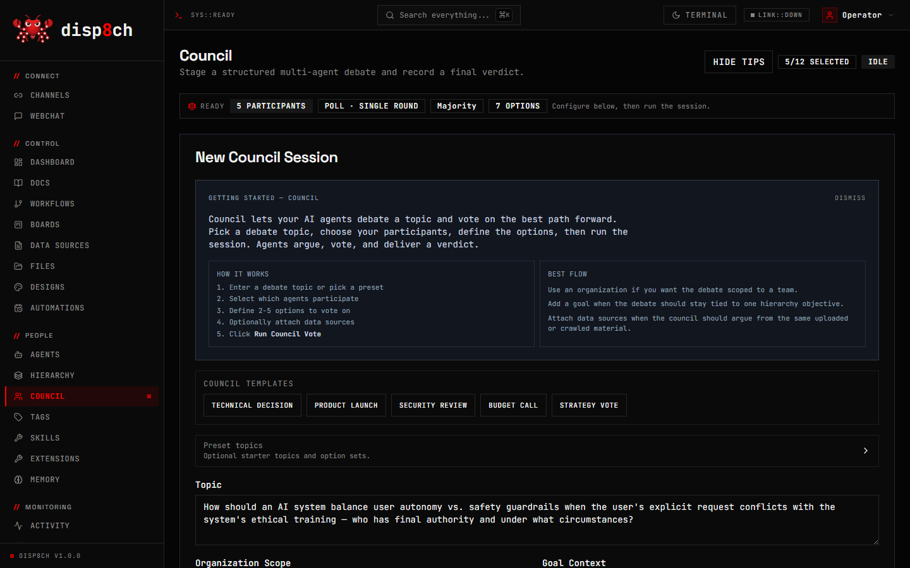
</p>

**Council** stages a structured multi-agent debate: each agent argues a position, raises concerns, and votes, and the chamber records a final verdict. The **deliberation transcript** makes the reasoning behind the decision legible — every agent's argument, not just the final answer.

<p align="center">
  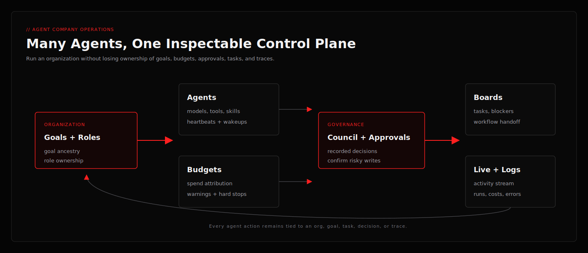
</p>

## How The Tabs Work Together

disp8ch is built around one operating loop, not a pile of disconnected tools:

1. **Data Sources** ingests PDFs, documents, scraped pages, crawled docs sites, and connected-source snapshots into searchable context.
2. **WebChat** asks questions over that context, inspects app state, proposes plans, creates tasks, drafts workflows, and hands work to agents.
3. **Council** turns important decisions into structured debate with recorded options, votes, and verdicts.
4. **Hierarchy** assigns goals to organizations, roles, agents, budgets, reporting lines, heartbeats, and governance rules.
5. **Workflows** turns repeatable work into triggerable automations with cron, webhooks, RSS, channels, files, documents, memory, boards, agents, and response nodes.
6. **Boards** tracks the follow-up work created by WebChat, Council, Hierarchy, Data Sources, channels, or workflow outputs.
7. **Capabilities** keeps Memory, Skills & Extensions, and MCP Servers together without mixing their responsibilities. Hierarchy Ops can merge an approved skill/extension preset into an existing team, while MCP access is scoped separately per server.
8. **Operations** keeps Activity, Usage & Costs, and Maintenance visible; approvals, workflow-run detail, logs, and debug tools remain one click away under **More tools** when needed.
9. **Design Studio** saves generated artifacts into the same workspace, so a design can become a board task, workflow, source, or decision instead of a one-off image.

That means a research brief can become a cited WebChat answer, then a Council decision, then a Hierarchy goal, then workflow-backed board tasks, then a saved design artifact — with one audit trail instead of five separate apps.

## Core Features

### Agentic WebChat

- Plain-English assistant with app-aware tools.
- Universal agentic runtime for non-trivial research, repo inspection, app capability audits, design tasks, workflow planning, and code edits.
- Deterministic paths only for direct slash commands, tiny arithmetic, explicit no-tool transforms, memory acknowledgements, and protected app reads.
- Post-answer verification, source/file grounding, tool-markup sanitization, and honest missing-evidence handling.
- Depth you control with plain words: design/analysis answers are rich by default; say "quickly" or "keep it short" for an instant compact answer, or "thorough" for maximum depth.
- Chat session management: rename, export, and prune conversations.
- Risk-gated code-edit verification with changed-file accounting, behavioral probe checks, and false-green protection.
- Build and edit workflows in plain English: create from a template, run, activate, and change a node's prompt, model, URL, or config from chat — applied as confirmation-gated, typed actions. The agentic runtime stays read-only; nothing mutates until you confirm.

### Visual Workflow Automation

- Drag-and-drop node canvas for message triggers, webhooks, cron, manual triggers, GitHub events, agent calls, HTTP, RSS feeds, files, documents, memory, logic, boards, channels (incl. SMS and GitHub comments), and utility actions.
- Workflow templates for chat assistants, task routing, monitoring, scheduled reports, data processing, document intelligence, docs-site crawling, RSS/news monitoring, local lead enrichment, support/community triage with human-review drafts, evidence-backed strategy hardening loops, research loops, experiment loops, code review, channel intake, ops control towers, crew orchestration, short-video/content pipelines, and integrations.
- A ready-made automation recipe pack: nightly issue triage, pull-request review, docs-drift detection, dependency vulnerability scanning, deploy smoke verification, incident alert correlation, endpoint uptime watch, competitor-repo watching, weekly news digests, and a research-paper scanner — each pre-wired with a trigger, agent, and delivery.
- Notify-only-on-change: an agent (or node) can emit `[SILENT]` and the downstream send/notification node suppresses delivery — so scheduled checks stay quiet until something actually needs attention.
- Import/export, duplicate, replay, node testing, run-to-node, versions, trace drawer, credentials, data mapping, expression preview, and workflow-as-agent-tool behavior.
- An Executions view across all workflows with status filters, retry, and retry-from-failed-node.
- Per-workflow concurrency control: skip duplicate starts (default) or queue them durably (FIFO) with a max-concurrent limit — queued starts survive restarts.
- Per-workflow budget and escalation policy: cap runs/cost per day with optional auto-disable, and route threshold/failure escalations with notification limits and quiet hours — so unattended automations stay within guardrails.
- Webhook-triggered workflows can answer the HTTP caller directly with a response node (custom status/body/headers), or return a poll URL if the run takes longer.
- Import workflow JSON from other visual automation tools, with unsupported nodes preserved as visible placeholders instead of silently discarded.

### Dynamic Runs And Agent Harnesses

- Dynamic Runs turn long-running goals into durable phase/worker plans with events, run status, pause/resume/cancel, worker or phase restart, verification metadata, and saved reusable commands.
- Use `/loop <objective>` from WebChat to start a dynamic workflow run, `/loop status` to inspect it, and `/loop pause|resume|cancel` to control the active run.
- The Workflows tab includes **Dynamic Runs** beside My Workflows and Templates, so autonomous work is visible without opening a separate app.
- Project Manager Agent Harness creates a five-phase manager workflow for repo work: triage, research, implementation/recommendation, review, and verification/report with command checks and screenshots.
- Repo Audit Harness provides a smaller read-only audit pattern when you need a quick codebase health report.

### Automations: Cron And Webhooks

- Cron workflows with schedule summaries, run-now, resync, enable/disable, and WebChat-readable state.
- Guided setup turns plain choices such as daily, weekly, interval, or one-time into validated schedules, with optional delivery destinations, retry behavior, and overlap control.
- Signed webhook execution with HMAC verification, timestamp/nonce replay protection, body caps, rate limiting, workflow execution, and secret rotation.
- WebChat can answer questions such as "list my automations", "show webhook signing help", and "design a daily digest job" using actual app state.

### Memory, Skills, And Self-Improvement

- Durable local memory, fast same-session and cross-session recall, memory health, retrieval explain, FTS fallback, vector index support, and cleanup review.
- Atomic batch add, replace, and remove operations use a journaled SQLite/file transaction so a failed update does not leave memory half-changed.
- A deepening picture of you over time: durable user/profile memory plus session history search, so the assistant remembers preferences and past work across conversations without re-injecting everything into every turn.
- Simple "remember this: key = value" saves and "what is …?" recalls answer in well under a second — deterministic, no model round-trip and no per-turn context tax.
- Skills from bundled packs, optional packs, workspace folders, agent-local folders, extension packs, local folders, and git sources — compatible with common open skill layouts.
- Aggregated skill search across all sources with provenance and trust signals, security scanning of imported skills (disabled until reviewed), and a verification harness that runs a skill against a fixture and checks it produces the required output sections.
- Source-aware skill previews let you inspect the exact matching skill before installation, even when multiple hubs use the same name.
- Reviewable self-learning loop: after work, the agent proposes memory, skill, support-file, and test improvements for your approval instead of silently rewriting your profile.
- Learning modes: Off, Review, and Auto (with an auto-promote threshold so recurring lessons compound only after repeated signal).
- Startup profile files live under `data/workspace/` by default and stay readable/editable markdown.

### Multi-Agent Operations

- Agents with model overrides, tool controls, budgets, skills, channel routing, cron/wakeup hooks, and workspace files.
- Parallel sub-agents: spawn isolated sessions and coding agents (with optional git-worktree isolation), coordinate them through a shared agent inbox, and gate work with blocker dependencies — so a crew works in parallel instead of one serial chat.
- Background sub-agents return a handle immediately; current and recent jobs remain visible in Activity, and completed results re-enter their originating chat.
- Boards for task intake, blocked work, saved views, labels, comments, workflow-backed actions, and execution handoff.
- Kanban typed blocks: blocked tasks carry a typed reason (dependency, needs input, capability, transient, approval, external) with a human-readable cause. Same-cause repeats are fingerprinted and counted, and repeated transient or capability blocks escalate to human triage in the Attention Center, while dependency blocks still auto-resume when their blockers finish. Blocked cards expose recovery actions (Resolve, Ask human, Convert to approval, Create unblock task, Retry once) and there is a board-level "Needs human" filter.
- Hierarchy for multiple organizations, roles, reporting lines, goals with full goal ancestry, source packs, workload, heartbeat history, budgets, and governance context — one deployment can run several organizations.
- Governance you control: confirmation gates, approval chains, budget warnings and hard-stops, config revisions with rollback, and an immutable activity/audit trail with cost attribution.
- Workflow side-effect approval: every node's effect is classified by its actual configuration (an HTTP GET reads, a POST writes externally, a DELETE is destructive; SQL is classified by verb) and checked immediately before it runs. Tools called inside an AI Agent inherit the same workflow policy. Reads run automatically; external and irreversible actions appear in Approvals with a redacted exact-action preview and Deny or Allow Once. Approval is bound to the exact workflow version, node, target, and payload, so a changed action cannot reuse an old approval, and a small hardline floor blocks catastrophic host operations that no approval can authorize. Unattended cron/webhook runs fail closed for high-risk effects.
- Workflow memory scope: new AI Agent nodes visibly offer no durable memory, private memory for this workflow, or memory shared by this agent. Workflow-private entries are keyed by both workflow and agent, run data stays isolated per execution, filtering happens before ranking, and a broader scope is never inferred from the model's request.
- Cross-surface memory candidates: chat, a workflow result, a Board task, a Council verdict, or a notebook finding can propose durable memory through one evidence-linked, reviewable path. Nothing is saved until you approve it in the Memory Explorer; promotion reuses the same scoped write path so workflow-private memory stays private. Exact duplicates reinforce the existing entry, and a conflicting preference or fact is flagged for you to decide — it is never silently overwritten.
- Source-to-skill learning: turn documents, notebooks, or a bounded folder into a reusable skill. The app builds a hashed, ignore-aware source pack (it never scans a whole drive and never stores env/credential/binary files), compiles a candidate with the active model, runs deterministic verification (no secrets, grounded URLs, a verification step, safe names), and only installs it with provenance after you approve it in **Skills → Learn from sources** or via WebChat `/learn from <document or notebook id>`. Learned skills are never auto-installed and never bypass the skill guard; source drift is detectable by hash.
- Computer use (beta, optional, off by default): provider-neutral desktop control through a Cua backend, separate from browser automation. The model can list or launch apps, resolve a natural prompt like "the window titled X" to the exact native window, inspect bounded accessibility trees, capture screenshot-plus-elements (`som`), screenshot-only (`vision`), or accessibility-only (`ax`) state, zoom into small regions, click by fresh element token, set native field values, type, scroll, drag, and verify state after an action. Browser DOM tools remain the preferred path for ordinary web-page content; Cua is for native apps, browser chrome, and operating-system UI. Every action is policy-classified, sessions and screenshots have bounded local audit trails, dangerous host input is hard-blocked, and payments, deletions, credentials, sends, settings changes, app launch, and focus changes require inline approval. It stays disabled until installed, enabled, and checked in **Settings → Computer Use**.
- Cross-tab work trails: a single confirmed plan can create and link objects across Hierarchy, Council, Workflows, Scheduler, Boards, and Goals, recorded as one inspectable trail (Prompt → Org → Council → Workflow → Task).
- Council for structured multi-agent debate, options, weighted votes, document context, and final verdict summaries.
- A usage overview (7/30/90 days): model calls, tokens, cost, workflow runs, error rate, and top models/workflows at a glance.
- Standing goals with `/goal`, `/subgoal`, pause/resume/status/clear, daemon processing, and board task decomposition.

### Research, Notebooks, And Data Sources

- Multi-provider web search (Tavily, Brave, DuckDuckGo) with automatic fallback, plus browser automation (`browser_navigate`, `web_crawl`, `web_extract`) for pages that need rendering.
- Upload PDF, DOCX, PPTX, TXT, Markdown, and HTML files.
- Import a local Markdown folder (e.g. an Obsidian vault) as searchable data sources — frontmatter and links preserved, re-imports update in place instead of duplicating.
- Scrape/crawl websites and create searchable, citable data sources with semantic (meaning-based) search, not just keywords.
- Group sources into notebooks with per-source context modes, an in-place notebook assistant, notes, and generated outputs — interactive mind maps (visual graph view with export), timelines, and audio-overview scripts — with chunk-level citations that link back to the exact passage.
- Ask from a notebook when the source boundary should stay narrow, or ask WebChat to search, inspect, summarize, cite, compare, and turn documents into tasks, goals, Council sessions, designs, or workflows. The Data Sources tab manages context; WebChat is the global synthesis and action surface.
- Source-category planning, exact-version caveats, and explicit uncertainty handling for current web research — answers are grounded in real URLs and files, not guesses.
- A repeatable experiment loop (init → run → log) and research-pipeline templates for structured, evidence-driven investigations.
- **Hierarchy → Research Team** creates an editable Scout → Analyst → Briefer team, workflows, schedules, and a local markdown knowledge vault in one guided setup, with Basic, Standard, and Advanced tiers.

Use **Data Sources** when you want the app to store files, crawled pages, or folders as searchable, citable context. Use **Notebooks** when several sources belong together and you want a narrow source boundary, notes, citation previews, timelines, mind maps, or other generated outputs. Ask inside the notebook for source-specific follow-ups; use WebChat when the answer should become a task, workflow, council session, design, goal, or broader cross-tab action.

Use **`/learn`** when the source material should become a reusable operating skill instead of only context for one answer. For example, `/learn from document <id>` or `/learn from notebook <id>` builds a bounded source pack, asks the active model to compile a skill candidate, verifies it for safe structure and source grounding, then leaves it pending for review. Learned skills are not installed automatically.

### Design Studio

- Create and revise designs without leaving Design Studio. Its compact assistant uses the same WebChat session, model, tools, and history rather than a separate chat backend.
- The active project, artifact, version, recipe, and design system are attached automatically. In Comment mode, select an element and ask for a change without copying its id, bounds, text, or styles into the prompt.
- Open the same conversation in full WebChat and return to the exact project and artifact when a broader cross-tab request needs more space.
- Import standalone HTML, HTML snippets, source-code reference files, image URLs, or uploaded images directly from the Designs tab.
- Attach an image in WebChat and request a controlled edit such as changing a color or removing a background; supported image providers receive the original asset rather than only its filename.
- Use design templates and artifact history for UI concepts, landing pages, dashboards, diagrams, posters, decks, and app screens.
- Start from a clear four-card intake (Generate from brief, Import screenshot/mockup, Import HTML/source, Start from template), pick a recipe pack (with required sections, a quality checklist, and an output contract) and a curated design system (tokens plus progressive disclosure). Imported images and framework/source code come in as references and convert to editable standalone HTML on request, while standalone HTML opens directly as an artifact.
- Preview, revise, validate, version, and export persistent artifacts instead of losing work in a chat transcript.
- Select marked elements directly in the preview or layer tree and edit their text, links, position, dimensions, spacing, typography, colors, borders, flex/grid alignment, effects, and opacity. One Apply action creates one immutable artifact version, and only changed inline properties are written so responsive styles and design-system rules remain intact.
- Keep design work connected to the same agentic runtime, memory, Data Sources, Boards, Council, Hierarchy, and Workflows.

### Connect Anything: MCP, Extensions, And Tools

- Open **MCP Servers** under **Capabilities** to connect Model Context Protocol tools and resources. The catalog, per-tool enablement, approval policy, connection diagnostics, and named agent access picker live on this dedicated page. Skills and Extensions remain separate because they are reusable capability packs, while MCP configures external processes, credentials, trust, and runtime access.
- Install extension packs for channels, providers, memory backends, and integrations, and enable them per agent. In **Hierarchy → Ops**, an approved preset can be merged into every current organization member without removing existing capabilities.
- Define custom tools and expose any workflow as an agent tool — extend the agent without forking the app.

### Voice

- Text-to-speech and speech-to-text via configurable providers (ElevenLabs, Whisper, and OpenAI-compatible endpoints).
- Wire voice nodes into workflows and channels for spoken input and output.

### Desktop And Work Supervision

- Activity includes a live Work Monitor for agents, workflows, and background sub-agents, with desktop watch windows for individual sessions.
- The Attention Center surfaces approvals, failed work, and actionable alerts without requiring users to inspect every operations page.
- `Ctrl/Cmd+K` opens the shared command palette; keyboard shortcuts can be rebound under Settings.
- The optional Developer Workspace provides file and layout panes. Its embedded terminal remains gated until the native PTY dependency is packaged for the target platform.

### Channels And Gateway

- Reach the assistant on the channels you already use: WebChat is built in, with setup/status paths for Telegram, Discord, WhatsApp, Slack, Google Chat, BlueBubbles/iMessage-style usage, Microsoft Teams, and SMS delivery.
- Smooth token streaming on Telegram: long replies appear quickly and update in place as they generate (rate-limit-safe), instead of arriving as one delayed block.
- Multi-agent routing: route inbound channels, accounts, or peers to isolated agents with their own workspaces and sessions, so different surfaces map to different agents.
- Channel work can be routed into workflows, boards, agents, memory, and scheduled automations.
- Inbound DMs are treated as untrusted: DM pairing/allowlists, command approvals, and optional per-session sandboxing keep channel access safe.
- Run disp8ch on your own machine or a server and talk to it from those channels while it works — it is not tied to one laptop session.

#### Connect Telegram

1. In Telegram, open **BotFather**, run `/newbot`, and keep the returned token private.
2. In disp8ch, open **Channels → Telegram**, paste the token, and click **Connect**. The token is stored through the app's secret store, not in agent prompts.
3. Send the bot a message, then check the Telegram status card or **Channel Doctor** if it does not arrive.
4. Approve the pairing request or add the chat to the allowlist before granting access to tools or private workspace data.

For headless installs, set `TELEGRAM_BOT_TOKEN` in `.env.local` and restart the app. Never commit that file. Discord and Slack follow the same token-and-status flow; WhatsApp uses its QR or configured business adapter. Google Chat requires `GOOGLE_CHAT_AUDIENCE`, while Microsoft Teams requires its app ID and credential. Google Chat and Teams inbound requests are signature-verified and fail closed when their authentication configuration is incomplete.

### Model Freedom

Use one provider or many:

- Direct cloud APIs: OpenAI, Anthropic, Google, DeepSeek, Groq, Together, Mistral, xAI, Qwen/DashScope, Moonshot/Kimi, Zhipu, and other configured providers.
- OpenRouter for many hosted models behind one key.
- OpenAI-compatible local runtimes: Ollama, llama.cpp server, LM Studio, vLLM, SGLang, and similar endpoints.
- Per-agent model overrides and settings UI.

## What You Can Use It For

- **Personal chief-of-staff:** track goals, remember preferences, schedule recurring checks, summarize documents, and keep a live task board.
- **Research analyst:** compare products, collect current sources, separate confirmed facts from uncertainty, and produce cited briefs.
- **Local coding operator:** inspect repos, propose patches, edit files when asked, run verification, and explain changed files.
- **Workflow builder:** build webhook-to-LLM-to-channel flows, scheduled reports, triage workflows, and data-processing automations.
- **Local AI automation stack:** combine local models, local documents, workflow templates, webhooks, RSS, file operations, and vector search without a managed cloud account.
- **Notebook-to-action workspace:** upload source material, ask cited questions in WebChat, create board tasks, brief a Council, and turn the resulting decision into a workflow.
- **Agent team operator:** assign goals to agents, watch heartbeats, use budgets and approvals, coordinate parallel workers, and keep every task linked back to the organization goal.
- **Content studio:** turn research into outlines, drafts, social calendars, image/design briefs, and review queues.
- **Support desk:** route channel messages into boards, summarize tickets, trigger workflows, and escalate risky actions for approval.
- **Autonomous company dashboard:** create an organization, define goals, assign agents, monitor heartbeats, track costs, and review decisions.
- **Decision council:** ask several agents to debate a product, security, architecture, hiring, or budget question before you decide.
- **Design lab:** generate UI concepts, landing page drafts, product mockups, dashboards, diagrams, decks, and visual artifacts from chat.
- **Local model lab:** test cloud, OpenRouter, and local OpenAI-compatible model endpoints from the same app.

## Quick Start

### One-line install

The one-line installers are the easiest path for non-technical users. They download a managed Node.js 22 runtime if needed, use Corepack or `npx pnpm`, fetch the app source, install dependencies, create a clean local workspace, start disp8ch, and open onboarding.

### Linux, macOS, or WSL

```bash
curl -fsSL https://raw.githubusercontent.com/aaronnat23/disp8ch/main/scripts/install.sh | bash -s -- --repo https://github.com/aaronnat23/disp8ch.git
```

Add `--no-start` to install without starting the server.

Computer Use beta is **not installed by default**. Skip this unless you want the optional Cua desktop-control driver.
To install it during first setup:

```bash
curl -fsSL https://raw.githubusercontent.com/aaronnat23/disp8ch/main/scripts/install.sh | DISP8CH_WITH_COMPUTER_USE=1 bash -s -- --repo https://github.com/aaronnat23/disp8ch.git
```

You can also install disp8ch first and enable Computer Use later from **Settings -> Computer Use**.

### Windows PowerShell

```powershell
$env:DISP8CH_SOURCE_ZIP_URL = "https://github.com/aaronnat23/disp8ch/archive/refs/heads/main.zip"; iex (irm "https://raw.githubusercontent.com/aaronnat23/disp8ch/main/scripts/install-windows.ps1")
```

Pass `-NoStart` to the script to install without starting.

Computer Use beta is **not installed by default**. Skip this unless you want the optional Cua desktop-control driver.
To install it during first setup:

```powershell
$env:DISP8CH_WITH_COMPUTER_USE = "1"; $env:DISP8CH_SOURCE_ZIP_URL = "https://github.com/aaronnat23/disp8ch/archive/refs/heads/main.zip"; iex (irm "https://raw.githubusercontent.com/aaronnat23/disp8ch/main/scripts/install-windows.ps1")
```

This installs the optional Cua desktop-control driver, writes non-secret `DISP8CH_ENABLE_COMPUTER_USE=1` and `DISP8CH_CUA_DRIVER_CMD` values when the driver is found, and keeps readiness gated by **Settings → Computer Use → Run doctor**. If Cua install fails, disp8ch still installs and the settings page shows the remaining setup.

After install, onboarding opens at:

```text
http://localhost:3100/onboarding
```

### From a cloned checkout

If you already cloned the repo:

```bash
node install.js
```

Windows PowerShell from a cloned checkout:

```powershell
powershell -ExecutionPolicy Bypass -File .\install.ps1
```

### Manual developer path

Use this if you already have Node.js `22.13+` and want full control:

```bash
corepack enable
corepack pnpm install
corepack pnpm dpc init --ensure-env
corepack pnpm dev
```

Later runs from the installed app directory:

```bash
pnpm dev
```

Windows native install and local desktop packaging work, but public desktop installers are currently unsigned. macOS builds may show security warnings until Developer ID signing and notarization are added. Linux source install is the cleanest path today; native packages need release validation.

## First Model Setup

The easiest path is `/onboarding`. disp8ch supports four setup paths:

| Path | Use when | Credential model |
|---|---|---|
| **Online API key** | You want a hosted provider such as DeepSeek, OpenAI, Anthropic, Google, or OpenRouter. | Store a key as an environment variable or secret reference. |
| **Local AI** | You want private local inference through Ollama, LM Studio, llama.cpp, vLLM, SGLang, or another OpenAI-compatible server. | No provider key required. |
| **Claude account OAuth** | You already use Claude Code and want Anthropic models without managing a separate Anthropic API key. | Local Claude Code credentials or an OAuth token reference. |
| **Codex account sign-in** | You want optional coding-agent delegation through the installed Codex CLI. | Local Codex CLI session. Not the default WebChat model provider. |

For API key or local setup:

1. Choose **Online** and add an API key, or choose **Local**.
2. For Local, select **Check this PC** to inspect installed models, available RAM and VRAM, and detected runtimes.
3. Run the recommended Ollama or `llama-server` command, then select **Use this setup**.
4. Run validation, then open WebChat and send a message.

For Claude account OAuth:

1. Install and sign in to Claude Code on the same Windows user that runs disp8ch.
2. Keep the Claude Code credential file private. Do not copy `.claude`, OAuth token files, or auth JSON into the repo.
3. In disp8ch, select or add an Anthropic model in **Settings -> Models**.
4. If the model form asks for a credential, use an environment or secret reference such as `env:ANTHROPIC_TOKEN`, `env:ANTHROPIC_OAUTH_TOKEN`, `env:CLAUDE_CODE_OAUTH_TOKEN`, or `secret:CLAUDE_CODE_OAUTH_TOKEN`.
5. Run the model test before using the model in WebChat or workflows.

For Codex account sign-in:

1. Install the Codex CLI and sign in locally with your Codex account.
2. Keep Codex auth files outside the repo and outside `.env.local`.
3. Leave normal WebChat on your selected provider or local model. Codex sign-in is only used when you explicitly choose the Codex coding-agent backend for delegated coding work.
4. Test with a harmless read-only delegation before granting write access.

You can also configure `.env.local`:

```bash
cp .env.example .env.local
```

Direct provider examples:

```bash
OPENAI_API_KEY=...
ANTHROPIC_API_KEY=...
ANTHROPIC_TOKEN=...
ANTHROPIC_OAUTH_TOKEN=...
CLAUDE_CODE_OAUTH_TOKEN=...
GOOGLE_API_KEY=...
DEEPSEEK_API_KEY=...
```

OpenRouter:

```bash
OPENROUTER_API_KEY=...
```

Local model endpoints:

```bash
OLLAMA_BASE_URL=http://127.0.0.1:11434
VLLM_BASE_URL=http://127.0.0.1:8000/v1
SGLANG_BASE_URL=http://127.0.0.1:30000/v1
```

Do not commit `.env.local`, `.claude`, `.codex`, auth JSON, OAuth token files, or any local credential store.

## Run Fully Local (No API Key)

You do not need a cloud account or API key for core use. Run a local model server and point disp8ch at it — chat, local tools, memory, workflows, agents, boards, council, local document research, and local artifact work can run without a model-provider key. Live web search, external channels, cloud image generation, and third-party APIs still need network access and the credentials you choose to configure.

<p align="center">
  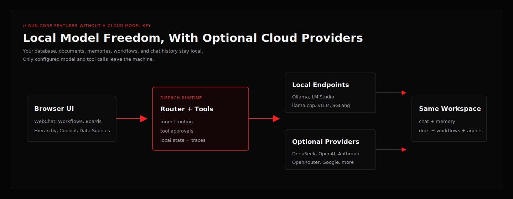
</p>

### Pick A Model That Fits This PC

During onboarding, choose **Local** then select **Check this PC**. You can also open **Settings -> Models** later and
select **Check this PC** under **Find a local model for this PC**. The advisor reads the machine's RAM, CPU, GPU, and
VRAM and ranks local models by fit and expected speed. It parses installed GGUF metadata, detects exact Ollama tags,
uses `llama-fit-params` when available, and distinguishes full GPU, hybrid offload, CPU-heavy, and memory-risky plans.

#### The simple path for new users

1. Install and open disp8ch, then choose **Local AI** during onboarding.
2. Select **Check this PC**. The check is read-only and does not download a model or send your hardware details anywhere.
3. Review the three recommendations:

| Choice | Best for | What to expect |
|---|---|---|
| **Balanced** | Most users | The best starting point for useful answers without making the computer unnecessarily slow. |
| **Speed** | Older PCs, laptops, and quick chat | A smaller model that is more likely to fit fully in GPU memory and respond quickly. |
| **Quality** | Research, coding, and harder tasks | The strongest practical model found for the machine. It may use both GPU memory and system RAM, so it can be slower. |

The results show the detected CPU, RAM, GPU, free VRAM, installed local runtimes, and models already on the PC so the
recommendation is explainable. Start with **Balanced** when unsure. Select **Use this setup**, run the connection test,
and then open WebChat. If the model is not installed or running, disp8ch shows the exact Ollama or `llama-server`
command to run first.

Model priority controls routing. Complex chat turns and background learning use the highest-priority active model
configuration first, including that configuration's API key and base URL. Cost is only a tie-breaker inside the same
priority, so an optional local endpoint will not steal background work unless you deliberately make it primary.

**What disp8ch does not do:** it does not silently download models, start unknown executables, replace the active
model, or upload local model paths and hardware inventory. Recommendations remain suggestions until you explicitly
run the displayed command and save the setup.

The advisor is runtime-neutral:

- An existing GGUF file is paired with the detected `llama-server` and its exact file path.
- An installed Ollama model stays on Ollama.
- A download suggestion prefers an exact validated Ollama tag when one exists because it is the simplest install path.
- Nothing is downloaded, started, or activated automatically.

Choose **Test and review** after configuring a model. A successful connection test creates a non-blocking advisory.
Private or cloud model IDs remain valid even when they are absent from the public catalog; disp8ch does not claim that
a local model is more accurate without comparable evidence.

For installed models, **Benchmark on this PC** is optional and confirmation-gated. It runs a bounded streamed prompt,
records first-token and generation timing for the exact model/runtime/hardware/context combination, then uses that
measurement ahead of static estimates. Temporary llama.cpp servers bind only to `127.0.0.1`; Ollama models loaded by
the benchmark are unloaded afterward. Calibration never changes the active model.

The production model list is bundled with each disp8ch release. It contains manually verified model names, exact runtime
tags, expected size, architecture, context, and capability metadata. It never sends your hardware inventory, model
paths, or provider credentials anywhere. New model families are added in normal app updates after verification.

### Option A — Ollama (easiest)

1. Install [Ollama](https://ollama.com) and start it.
2. In onboarding, select **Check this PC** and use the exact `ollama run ...` command shown for the recommended model.
   Ollama downloads that model only after you run the command yourself:

```bash
ollama serve
ollama run <recommended-model-tag>
```

3. Open onboarding at `http://localhost:3100/onboarding`, choose **Local**, select **Check this PC**, run the shown command, then select **Use this setup**, test, and save. No key required.

Memory search works without choosing a separate provider. New installs default to disp8ch's built-in local embedding model (`Xenova/all-MiniLM-L6-v2`) and fall back to keyword search if the model cache is unavailable. If you prefer Ollama embeddings instead, run `ollama pull nomic-embed-text`, set **Settings -> Memory -> Embedding model** to `nomic-embed-text`, then click **Rebuild Index**.

Or via `.env.local`:

```bash
OLLAMA_BASE_URL=http://127.0.0.1:11434
```

### Option B — LM Studio, llama.cpp, vLLM, or SGLang (OpenAI-compatible)

1. Start your local server and load a model.
2. In onboarding choose the **LM Studio / OpenAI-compatible** preset and set the base URL. Leave the API key blank when the local server does not require one:

| Runtime | Base URL |
|---|---|
| LM Studio (Local Server) | `http://127.0.0.1:1234/v1` |
| llama.cpp (`--server`) | `http://127.0.0.1:8080/v1` |
| vLLM | `http://127.0.0.1:8000/v1` |
| SGLang | `http://127.0.0.1:30000/v1` |

3. Run the test and save.

Or via `.env.local`:

```bash
VLLM_BASE_URL=http://127.0.0.1:8000/v1
SGLANG_BASE_URL=http://127.0.0.1:30000/v1
```

**Tip:** do not choose from parameter count alone. Context size, quantization, architecture, current free RAM/VRAM,
and runtime support all affect whether a model is practical. Real AI image generation, live web search providers,
external channels, and third-party APIs still need their own credentials, but the core local workspace runs without a
model-provider key.

## WebChat Examples

```text
What can this app currently do? Separate implemented, configured, and callable.
List my automations and show which webhooks are enabled.
Create a webhook workflow that validates a GitHub-style JSON payload and summarizes it.
Compare three local model runtimes for an 8 GB VRAM laptop. Use current sources.
Audit this repo's API-key handling and cite exact files.
Create a board task for each blocker in this launch document.
Start a council session on whether we should prioritize reliability or new features.
Build a daily 9 AM research digest workflow, but ask before saving if anything is ambiguous.
Spin up a research team, put them in an org, and give them a board task to compare OCR models.
Generate a landing page concept for a local-first AI workspace and save it as a design.
Remember that I prefer concise technical answers. Reply only saved.
What is my preferred answer style?
```

## Migration And Imports

Have useful work in another local AI app? Bring the parts you want into disp8ch when a compatibility importer exists. disp8ch imports skill packs, compatible workflow JSON, and company/org templates from popular local agent ecosystems and converts them into safe, native disp8ch assets — **it never copies your secrets, databases, chat history, or auth state**.

### Bring Work From Another App

| Coming from | Command | What moves over |
|---|---|---|
| A `SKILL.md` skill library | `pnpm dpc skills install <folder-or-git-url>` or the matching compatibility importer listed by `pnpm dpc` | Skills become safe, normalized disp8ch skill packs (provenance kept; risky command/credential examples stripped). |
| A personal channel-assistant workspace | `pnpm dpc skills install <repo-path>` plus the matching compatibility importer if available | Skills imported as above, **plus** matching extension packs (channels, providers, memory backends) are detected and recommended. |
| An agent-company / org dashboard export | `pnpm dpc orgs import <company-pack.json>` or the matching compatibility importer listed by `pnpm dpc` | A company export/template becomes a local organization with agents, roles, goals, budgets, and governance context when the source format is supported. |
| Another disp8ch instance | `pnpm dpc orgs import ./company-pack.json` | A native org pack (export yours with `pnpm dpc orgs export <organization-id> ./company-pack.json`). |
| Another visual workflow automation tool | Workflows tab → Import, or the workflows API | Workflow JSON; unsupported nodes are preserved as visible placeholders with repair hints instead of being dropped. |

Generic and additional paths:

```bash
pnpm dpc skills install /path/to/skill-pack          # local skill pack folder
pnpm dpc skills install https://github.com/user/skills-repo.git   # git source
pnpm dpc skills list
pnpm dpc orgs list
pnpm dpc                                             # full command list for your installed version
```

Desktop builds can also import an existing disp8ch database (the importer backs up your current DB first).

Import rules:

- Secrets are never imported silently — add them later through Settings → Secrets.
- Runtime databases, chat history, uploaded private docs, and auth sessions are not imported and are not in public releases.
- Imported skills are scanned for high-signal security issues, stored as local skill packs, and disabled until you review them.
- Imported company packs create local organizations, goals, and agent roles you can review before activating.
- Review imported skills and company templates before enabling them for agents.

## Security And Control

disp8ch is local-first, but local-first does not mean careless. The app includes:

- admin-gated APIs;
- confirmation gates for risky app actions;
- webhook HMAC, replay, body-cap, and rate-limit controls;
- command approvals and sensitive-path blocking;
- optional shell sandboxing;
- credentials and secret storage paths;
- activity logs, approval records, run traces, and cost attribution;
- backups, checkpoints, rollback-oriented workflows, and desktop data import backups.

You still control your deployment. Be careful with exposed ports, channel bot tokens, API keys, and any workflow that can write files, send messages, call paid APIs, or execute shell commands.

## Clean Public Release Expectations

This public repo should not include private runtime state.

Expected blank state:

- no `data/*.db`
- no `.env.local`
- no private memories
- no uploaded documents
- no chat history
- no auth sessions
- no private channel tokens
- no imported external packs

Reset to first-run state:

```bash
rm -rf data
pnpm dpc init --ensure-env
pnpm dev
```

Windows PowerShell:

```powershell
Remove-Item -Recurse -Force .\data
pnpm dpc init --ensure-env
pnpm dev
```

## Useful CLI Commands

```bash
pnpm dpc status
pnpm dpc health
pnpm dpc doctor
pnpm dpc models list
pnpm dpc workflows list
pnpm dpc boards list
pnpm dpc orgs list
pnpm dpc skills list
pnpm dpc backup status
pnpm dpc learning status
pnpm dpc goals list
```

Developer checks:

```bash
pnpm install
pnpm exec tsc --noEmit
pnpm build
```

Desktop checks:

```bash
pnpm desktop:build
```

The maintainer release suite is run from the private development workspace before public exports. The public repository intentionally excludes generated runtime state and private release artifacts.

## Repository Layout

- `src/`: Next.js app, API routes, UI, channel router, agents, workflows, memory, governance, and design surfaces.
- `server/`: websocket server.
- `desktop/`: desktop shell and packaging logic.
- `extensions/`: bundled extension packs.
- `skills/`: bundled skill packs.
- `optional-skills/`: optional local skill packs.
- `scripts/`: setup, CLI, export, verification, and packaging entrypoints.
- `docs/`: public README assets included in the clean release.
- `data/`: local runtime state created on first run.

## FAQ

**Do I need an API key or a cloud account?**
No for core local use. disp8ch can run with Ollama, LM Studio, llama.cpp, vLLM, or SGLang — see [Run Fully Local](#run-fully-local-no-api-key). Cloud providers and OpenRouter are optional. Claude account OAuth is supported for Anthropic model access when you already use Claude Code. Codex sign-in is supported for optional coding-agent delegation, not as the default WebChat provider. Live web search, channels, cloud image generation, and third-party APIs need the credentials you choose to configure.

**How is this different from a single-agent terminal assistant or a chatbot?**
Those are one capability. disp8ch is the whole workspace around them: visual workflows, scheduled automations, multi-agent operations, an org/company control plane, a decision council, memory and skills, research, and design — all driven from plain-English WebChat and a browser UI.

**Do I still need a separate document chat tab?**
No. Data Sources manages uploads, crawls, notebooks, notes, outputs, and citations. A notebook has an in-place assistant for source-specific follow-ups, and WebChat is the global ask/synthesis surface when document questions should become tasks, workflows, council sessions, designs, or organization goals without copying context between tabs.

**When should I use Data Sources, Notebooks, or `/learn`?**
Use Data Sources for searchable files and cited answers. Use Notebooks to group related sources, keep notes, ask follow-up questions inside a narrow source boundary, and generate cited outputs. Use `/learn` or Skills → Learn from sources when the material describes a repeatable procedure you want agents to reuse later as a skill. `/learn` creates a pending candidate with provenance; it does not auto-install or silently change agent behavior.

**Can I run more than one organization/company?**
Yes. One deployment can host multiple organizations with their own agents, goals, budgets, and governance.

**Can I bring work from the app I already use?**
Yes — import compatible skills, workflow JSON, and company/org templates when you want them in the same workspace. See [Migration and Imports](#migration-and-imports).

**Does it work unattended?**
Yes — cron schedules, signed webhooks, agent heartbeats/wakeups, and standing goals with a background daemon keep work moving without you in the loop. Risky and external actions stay confirmation-gated.

**Is my data private?**
It is local-first. Your database, memories, documents, and chat history stay on your machine; only the model/tool/channel calls you explicitly configure leave it.

**Can I reach it from my phone or messaging apps?**
Yes — run it on your machine or a server and talk to it from WebChat or connected channels (Telegram, Discord, Slack, WhatsApp, and more) while it works.

## Honest Boundaries

- This is a local-first self-hosted app, not a managed cloud service.
- Some channels and providers require third-party accounts or API keys; chat and core features run fully local with no key (see [Run Fully Local](#run-fully-local-no-api-key)).
- Optional capabilities depend on configuration: voice (TTS/STT) and web search/browser tools use providers you set up, and MCP/extension tools depend on the servers and packs you connect.
- Real AI image generation requires configured image-provider credentials; local browser fallback can create simple artifacts when no provider is configured.
- Public desktop installers are not yet signed/notarized.
- Long-horizon autonomous behavior works through goals, daemon processing, boards, and heartbeats, but real multi-day reliability depends on your model, tools, budgets, and deployment.
- The app is designed to be agentic for non-trivial work, but it intentionally keeps exact commands and protected reads fast and deterministic.

## License

Released under the [MIT License](LICENSE).
